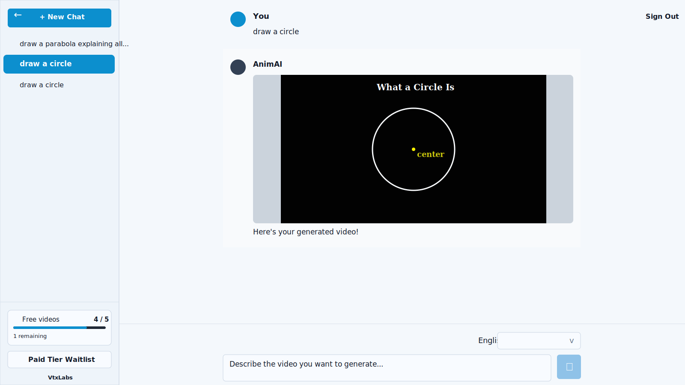
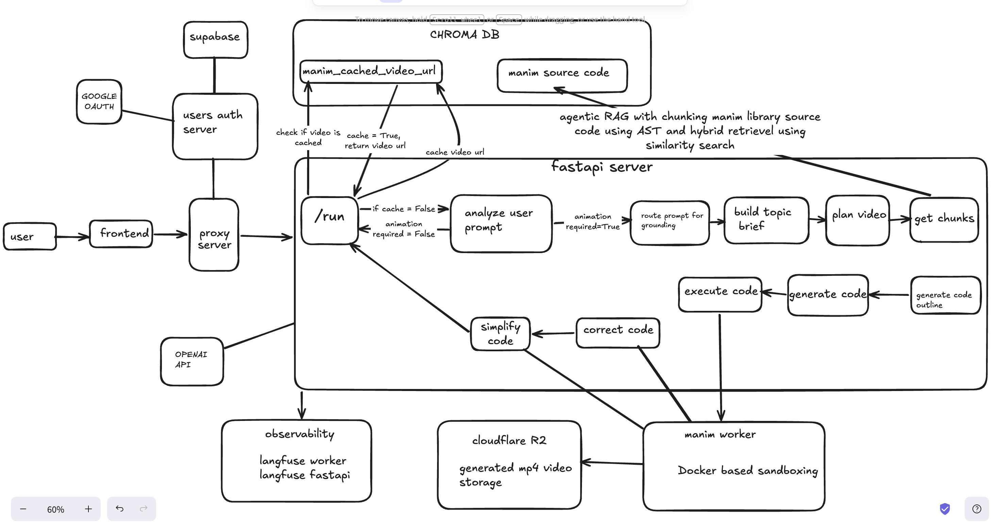

<p align="center">
  <a href="https://vtxlabs.space">
    
  </a>
</p>

<h1 align="center">AnimAI</h1>

<p align="center">
  Prompt -> researched lesson -> planned animation -> Manim code -> rendered STEM video.
</p>

<p align="center">
  <a href="https://vtxlabs.space">Website</a> |
  <a href="https://vtxlabs.space/gallery">Gallery</a> |
  <a href="https://vtxlabs.space/about">About</a> |
  <a href="#the-story-from-prompt-to-video">Pipeline</a> |
  <a href="#local-setup">Run locally</a>
</p>

<p align="center">
  
  
  
  
  
  
  
</p>

AnimAI is the backend and rendering system behind VTX Labs, a prompt-to-video product for STEM explanations. The product goal is simple: let someone type a topic like "draw the equation of SHM" or "explain binary search" and get a short animated video that teaches the idea visually.

The engineering work is less simple. A good educational video needs factual grounding, scene planning, Manim-aware code generation, render isolation, retry logic, video storage, and observability. This repo turns that complexity into a staged production pipeline.

## Product Snapshot

<p align="center">
  
</p>

The frontend experience is a chat-style prompt box that returns a playable generated video. The screenshot above shows the product flow after the prompt `draw a circle`: AnimAI returns a Manim-rendered explainer video directly inside the chat.

## Visual Architecture

This is the current architecture sketch used for the system overview.

### Architecture At A Glance

<p align="center">
  
</p>

## The Story: From Prompt To Video

The system is easiest to understand as one handoff chain. Each step shrinks a different kind of risk: bad prompts, weak facts, vague visuals, hallucinated APIs, failed renders, or lost video artifacts.

| Step | Agent / layer | Receives | Produces | Why it matters | Source |
| --- | --- | --- | --- | --- | --- |
| 1 | API boundary | `POST /run` with prompt, language, and client request | Cached URL, non-animation reply, or LangGraph invocation | Owns rate limits, cache lookup, tracing, and HTTP error handling before expensive work starts | [`src/api/main.py`](src/api/main.py) |
| 2 | Prompt Gatekeeper | Raw user prompt | `animation=true` or short out-of-scope reply | Prevents greetings, nonsense, backend probing, or unsupported requests from reaching the render pipeline | [`analyze_user_prompt.py`](src/agent/analyze_user_prompt.py) |
| 3 | Grounding Router | Accepted animation prompt | Domain, route, time sensitivity, named entities | Keeps generic concepts fast while forcing real-world or time-sensitive topics to be grounded | [`research_router.py`](src/agent/research_router.py) |
| 4 | Topic Researcher | Prompt, route info, optional web evidence | Factual brief with key facts, visual elements, process steps, misconceptions, sources | Turns the user's idea into a lesson plan before visuals or code are invented | [`research_topic.py`](src/agent/research_topic.py) |
| 5 | Scene Director | Topic brief and route info | One `SceneSpec` plus ordered `ShotPlan` items | Converts knowledge into screen continuity: objects, narration, movement, and teaching goals | [`plan_video.py`](src/agent/plan_video.py) |
| 6 | Manim Librarian | Shot plan, scene spec, topic brief | Manim API chunks, examples, allowed symbols, retrieval notes | Reduces hallucinated Manim calls by grounding each shot in real docs and examples | [`src/rag/retriever.py`](src/rag/retriever.py) |
| 7 | Code Architect | Scene plan and retrieval evidence | Code outline: scene class, helpers, shot functions, transitions | Locks structure before final code so the scene does not drift or reset randomly | [`generate_code.py`](src/agent/generate_code.py) |
| 8 | Manim Coder | Code outline, shot evidence, target language | Executable Manim Python scene class | Writes renderable code with `VoiceoverScene`, `GTTSService`, localized labels, and deterministic validation | [`generate_code.py`](src/agent/generate_code.py) |
| 9 | Render Runner | Code, scene name, request id, trace context | Worker job id, status polling, render result | Keeps generated-code execution outside the API and turns worker failures back into graph state | [`execute_code.py`](src/agent/execute_code.py) |
| 10 | Render Worker | Worker job payload | MP4 artifact or render error | Runs Manim in a request-scoped temp directory with timeout, artifact lookup, and cleanup | [`manim-worker/app.py`](manim-worker/app.py) |
| 11 | Repair Specialist / Simplifier | Render error, failed code, scene plan | Repaired code or simpler fallback code | Gives the system another shot when Manim fails, then favors a simpler successful video over a perfect broken one | [`regenerate_code.py`](src/agent/regenerate_code.py) |
| 12 | API response + cache | Final workflow state | Public video URL, cached result, or error payload | Returns something the frontend can play later and avoids regenerating near-identical successful prompts | [`src/api/main.py`](src/api/main.py) |

That full handoff is wired in [`src/agent/graph.py`](src/agent/graph.py), with shared state defined in [`src/agent/graph_state.py`](src/agent/graph_state.py). Observability hooks live in [`src/observability/langfuse.py`](src/observability/langfuse.py).

Few examples how videos are generated based on what prompt:
checkout https://vtxlabs.space/gallery

| Prompt idea | What AnimAI has to produce | Video URL |
| --- | --- | --- |
| Draw the equation of SHM | Graph, oscillator intuition, narrated motion | [Watch](https://pub-b215a097b7b243dc86da838a88d50339.r2.dev/media/videos/SimpleHarmonicMotionGraph/480p15/SimpleHarmonicMotionGraph.mp4) |
| Plot a 3D spiral curve expanding along the Z-axis | 3D path, camera-safe framing, readable labels | [Watch](https://pub-b215a097b7b243dc86da838a88d50339.r2.dev/media/videos/Spiral3DScene/480p15/Spiral3DScene.mp4) |
| Explain binary search in an array | Step-by-step algorithm animation | [Watch](https://pub-b215a097b7b243dc86da838a88d50339.r2.dev/media/videos/BinarySearchTutorial/480p15/BinarySearchTutorial.mp4) |
| Draw `y = x^3` | Clean axes, curve reveal, key behavior | [Watch](https://pub-b215a097b7b243dc86da838a88d50339.r2.dev/media/videos/CubicFunctionPlot/480p15/CubicFunctionPlot.mp4) |
| Visualize electron orbits in a hydrogen atom | Conceptual atomic model with caveats | [Watch](https://pub-b215a097b7b243dc86da838a88d50339.r2.dev/media/videos/HydrogenAtomOrbits/480p15/HydrogenAtomOrbits.mp4) |
| Draw `y = sin(x)` from `-pi` to `pi` | Periodic curve, marked extrema, narration | [Watch](https://pub-b215a097b7b243dc86da838a88d50339.r2.dev/media/videos/SineCurveWithKeyPoints/480p15/SineCurveWithKeyPoints.mp4) |

## Agentic RAG Layer

AnimAI does not ask the model to "just write Manim." It first breaks the Manim docs into AST-aware parent/child chunks, adds synthetic symbol chunks, and stores embeddings in Chroma so retrieval has real API structure to aim at.

Inside the LangGraph `get_chunks` node, retrieval is shot-specific: query building follows the planned scene, hybrid search mixes dense Chroma lookup with BM25 and exact symbol matches, and reranking narrows the allowed Manim surface before code generation starts.

To go deeper, read [`src/rag/chunks.py`](src/rag/chunks.py) for AST chunking, [`src/chroma_utils.py`](src/chroma_utils.py) for Chroma storage, [`src/agent/map_reduce.py`](src/agent/map_reduce.py) for the `get_chunks` node, and [`src/rag/retriever.py`](src/rag/retriever.py) with [`src/rag/query_builder.py`](src/rag/query_builder.py) for retrieval strategy.

## Local Setup

### Docker

```bash
docker compose up --build
```

Services:

| Service | URL |
| --- | --- |
| API | `http://localhost:8000` |
| Manim worker | `http://localhost:8080` |

### Direct Run

```bash
python -m uvicorn src.api.main:app --host 0.0.0.0 --port 8000 --reload
```

Run the worker separately:

```bash
uvicorn app:app --app-dir manim-worker --host 0.0.0.0 --port 8080 --reload
```

### Try A Prompt

```bash
curl -X POST http://localhost:8000/run \
  -H 'Content-Type: application/json' \
  -d '{"prompt":"Draw y = sin(x) from -pi to pi","language":"en"}'
```

Success response:

```json
{
  "result": "https://.../scene.mp4",
  "status": "success"
}
```

Other expected statuses:

| Status | Meaning |
| --- | --- |
| `non_animation` | The prompt was outside AnimAI's animation scope. |
| `error` | Generation or rendering failed after recovery attempts. |

## Environment

| Group | Variables |
| --- | --- |
| Core | `OPENAI_API_KEY`, `MANIM_WORKER_URL` |
| Cache + dense retrieval | `SEMANTIC_CACHE_ENABLED`, `CHROMA_OPENAI_API_KEY`, `CHROMA_OPENAI_EMBEDDING_MODEL`, `CHROMA_API_KEY`, `CHROMA_HOST`, `CHROMA_TENANT`, `CHROMA_DATABASE` |
| Worker | `MANIM_RENDER_TIMEOUT_SECONDS`, `MANIM_QUALITY_FLAG`, `MANIM_WORKER_POLL_SECONDS`, `MANIM_WORKER_MAX_WAIT_SECONDS`, `KEEP_RENDER_ARTIFACTS` |
| Publishing | `R2_ACCOUNT_ID`, `R2_ACCESS_KEY_ID`, `R2_SECRET_ACCESS_KEY`, `R2_BUCKET`, `R2_PUBLIC_BASE_URL`, `SKIP_UPLOAD`, `PUBLIC_MEDIA_BASE_URL` |
| Tracing | `LANGFUSE_PUBLIC_KEY`, `LANGFUSE_SECRET_KEY`, `LANGFUSE_BASE_URL`, `LANGFUSE_HOST`, `LANGFUSE_TIMEOUT`, `LANGFUSE_FLUSH_AT`, `LANGFUSE_FLUSH_INTERVAL`, `LANGFUSE_TRACING_ENVIRONMENT`, `LANGFUSE_AUTH_CHECK_ON_STARTUP` |

## Deploy

Production backend deployment is configured for Hostinger VPS.

| Piece | File |
| --- | --- |
| Docker Compose stack | [`docker-compose.hostinger.yml`](docker-compose.hostinger.yml) |
| GitHub deployment workflow | [`.github/workflows/deploy-hostinger.yml`](.github/workflows/deploy-hostinger.yml) |

The deployed stack runs:

```text
api -> http://manim-worker:8080 -> Cloudflare R2 or local media publishing
```

## Tests

```bash
pytest -q
```

Coverage focuses on API behavior, graph compilation, configuration, worker behavior, language registry, retrieval, research topic flow, Chroma utilities, and render-client behavior.

## Langfuse

Langfuse gives us prompt versions, traces, and logs across the API and worker, so we can inspect failures as one connected run instead of chasing them across services.

It also gives us cost visibility per request and prompt path, which helps us trim expensive branches, compare prompt changes, and keep generation quality high without wasting tokens.

## Legacy

These files are retained as older fine-tune graph experiments and are not the active production workflow:

| Legacy path | Status |
| --- | --- |
| [`src/agent/graph_fine_tune.py`](src/agent/graph_fine_tune.py) | Reference only |
| [`src/agent/generate_code_fine_tune.py`](src/agent/generate_code_fine_tune.py) | Reference only |
| [`src/agent/regenerate_code_fine_tune.py`](src/agent/regenerate_code_fine_tune.py) | Reference only |
| [`src/agent/fine_tune_agent`](src/agent/fine_tune_agent) | Reference only |

The active production workflow is [`src/agent/graph.py`](src/agent/graph.py).

## License

See [`LICENSE`](LICENSE).
